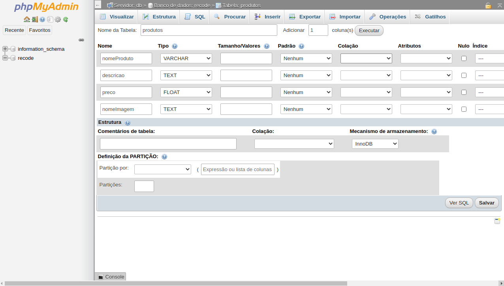
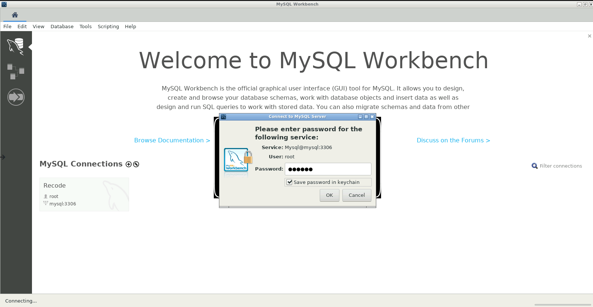

# Banco de Dados

<h3>esse projeto foi desenvolvido utilizando um servidor PHP dentro de um container docker, abaixo segue o README original do script de montagem do ambiente docker utilizado para rodar este projeto, o README e script original foram feitos por @hpbonfim, ao fim terá instruções extras para a instalção de dependências do projeto react</h3>
 
 
 

 Para realizar os exercícios de banco de dados

<h2>1. Instalar o Docker</h2>
<a href="https://blog.qaninja.io/instalando-o-docker/">Como instalar no Ubuntu / Mac / Windows</a>

<h2> 2. Instalar o Docker Compose</h2>
<a href="https://www.digitalocean.com/community/tutorials/how-to-install-and-use-docker-compose-on-ubuntu-20-04-pt"> Como instalar no Ubuntu</a>

No Windows / Mac a instalação é junto com o docker!</a>

<h2> 3. Execute o script</h2>

Clone este projeto para o seu computador usando <b><code>git clone https://github.com/hpbonfim/database-recodepro.git</code></b> ou fazendo o <a href="https://github.com/hpbonfim/database-recodepro/archive/master.zip">download via ZIP</a>

Depois de terminar, dentro da pasta <b>database-recodepro</b> existe um arquivo chamado <b><i>docker-compose.yml</b></i>

No terminal de comandos do seu PC: 

1. execute o comando <b><code>docker-compose up -d</code></b> e aguarde o download e quando aparecer DONE significa que está rodando!.

OBS: Existe um log, caso queira ver, escreva no terminal o comando <b><code>docker-compose logs </code></b>

Para encerrar, escreva no terminal o comando <b><code>docker-compose down </code></b>

 

<b>Para apagar tudo do seu computador, escreva no terminal os comandos:</b>

<ol>
    <li><b><code>docker-compose down </code></b></li>
    <li><b><code>docker rmi -f $(docker images -aq) </code></b></li>
    <li><b><code>docker rm - f $(docker ps -aq) </code></b></li>
    <li><b><code>docker volume prune -f </code></b></li>
    <li><b><code>docker system prune -f </code></b></li>
</ol>

<h2> 4. Utilização</h2>

Existem 3 serviços ao seu dispor:

<ul>
    <li>MySQL - Banco de Dados Relacional</li>
    <li><a href="#phpmyadmin">phpMyAdmin - Gerenciador do Banco</a></li>
    <li><a href="#workbench">MySQL Workbench - Outro Gerenciador do Banco</a></li>
</ul>

O MySQL é um serviço de segundo plano, ou seja, apenas aplicativos de primeiro plano conseguem utilizar e é ai que entra o phpMyAdmin

<h2 id="phpmyadmin">Para utilizar o phpMyAdmin, abra no seu navegador: <a href="http://localhost:8080">http://localhost:8080/</a></h2>
 
<h3>Você vai ver uma tela semelhante a esta abaixo</h3>

<h3>1. Para acessar o banco de dados, use as seguintes informações: </h3>
<ul>
    <li>Servidor: mysql</li>
    <li>Usuário: root</li>
    <li>Senha: recode</li>
</ul>

<h3>2. Entre no banco de dados chamado <b><code>recode</code></b></h3>

<h3>3. Crie suas tabelas</h3>

   
<h2 id="workbench">Para utilizar o MySQL Workbench, abra no seu navegador: <a href="http://localhost:3000">http://localhost:3000/</a></h2>
 
<h3>1. Você vai ver uma tela semelhante a esta abaixo</h3>

 
Selecione a caixinha e clique em OK

 

<h3>2. Para acessar o banco de dados, use as seguintes informações: </h3>
<ul>
    <li>Connection Name: Recode</li>
    <li>Hostname: mysql</li>
    <li>Username: root</li>
</ul>

Clique em OK

 

 
<h3>3. Entre no banco de dados criado: <b><code>Recode</code></b> e digite a senha</h3>
<ul>
    <li>Em todas os inputs, digite: <b>recode</b></li>
</ul>

<h3>4. Pronto para realizar as tarefas</h3>

<h3>5. Para obter todas as dependências do projeto React<h3>
<ul>
<li>utilize o comando <code>"npm install"</code> na pasta</li>
 
<li>e para iniciar o servidor utilize <code>"npm start"</code></li>
</ul>

